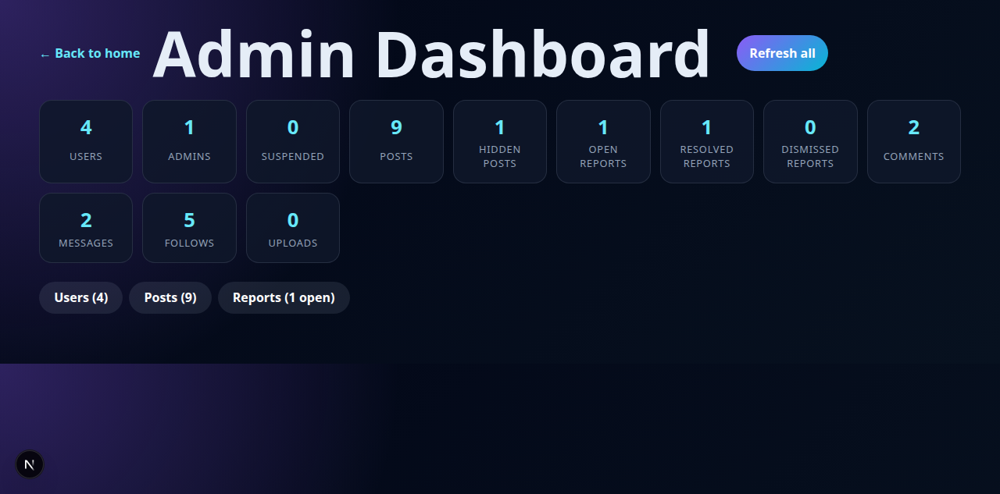

# Social Media MVP

[](https://github.com/Jdrexx/SocialMediaMVP/actions/workflows/ci.yml)

A working full-stack social media platform MVP — Express API, Next.js frontend, real-time chat, WebRTC video calls, and production-hardened auth. Built to be easy to upgrade and deploy.



## Features

- Express API with modular feature folders
- React/Next.js frontend in the App Router
- Mobile-friendly responsive UI
- Email/password auth with HTTP-only JWT cookie sessions
- Production auth hardening: required strong `JWT_SECRET`, secure cookies, `trust proxy`, hidden Express signature, tight rate limits
- Real SMTP email for password reset and email verification
- Local dev-token fallback for reset/verification during development
- Profiles with bio, photo, and cover image
- Image/video media uploads for posts
- Likes, comments, follow/unfollow
- Notifications (likes, comments, follows, messages)
- User/post search
- Post reporting and admin moderation dashboard
- Real-time chat via Socket.IO
- WebRTC video chat with Socket.IO signaling
- Typing indicators over WebSockets
- SSE compatibility for older clients
- Authenticated personal feed + public feed
- SQLite for local/dev, persistent volume required for production
- API tests and feature scaffolding helper

## Quick Start

Single-server mode, matching Railway production:

```bash
npm install
npm run build
npm start
```

Open: http://localhost:3000

Development mode with hot reload:

```bash
# Terminal 1
npm start
# Terminal 2
npm run frontend:dev
```

Open: http://localhost:3001 (proxies `/api/*` to port 3000)

Windows: double-click `run-social-mvp.bat`

## Tests

```bash
npm test
npm run frontend:build
```

All API tests pass and the Next.js production build succeeds.

## Admin Access

The first registered user is automatically granted admin privileges. After signing up as the first user, an **Admin Panel** link appears in the profile card on the home page. Visit `/admin` to manage users, posts, and reports.

Example accounts for local testing (register fresh to use them):

| Username | Email | Password | Role |
|---|---|---|---|
| admin | admin@social.com | Password123! | Admin |
| jane | jane@test.com | Password123! | User |

## Railway Deployment

Config in `railway.json`. Full instructions in `docs/RAILWAY_DEPLOYMENT.md`.

Minimum env vars:

```env
NODE_ENV=production
JWT_SECRET=<64+ char random secret>
PUBLIC_URL=https://your-domain.com
DB_FILE=/data/social.sqlite
```

Attach a Railway volume at `/data` so SQLite persists across redeploys.

## Environment Variables

```env
NODE_ENV=production
PUBLIC_URL=https://your-domain.com
JWT_SECRET=generate-a-64-character-random-secret
DB_FILE=/data/social.sqlite

SMTP_HOST=smtp.resend.com
SMTP_PORT=587
SMTP_SECURE=false
SMTP_USER=resend
SMTP_PASS=your-smtp-password
SMTP_FROM="Social Media MVP <noreply@your-domain.com>"

NEXT_PUBLIC_API_URL=https://your-api-domain.com
```

Generate a strong secret:

```bash
node -e "console.log(require('crypto').randomBytes(32).toString('hex'))"
```

Production fails fast if `JWT_SECRET` is weak or neither `DB_FILE` nor `DATABASE_URL` is set. Managed PostgreSQL migration is recommended for high scale.

## Project Structure

```
app/                          # Next.js frontend
├── layout.jsx
├── page.jsx
├── about-us/page.jsx
├── contact/page.jsx
├── pricing/page.jsx
├── rules-of-conduct/page.jsx
└── globals.css
legacy-frontend/              # Original HTML/JS/CSS frontend (pre-Next.js)
├── index.html
├── app.js
└── style.css
components/                   # Shared React components
├── api.js                    # API client utility
├── AuthForm.jsx              # Login / Register
├── Avatar.jsx                # Reusable avatar
├── ChatPanel.jsx             # Messages + video call
├── Feed.jsx                  # Post feed
├── NavLinks.jsx              # Front page navigation
├── NotificationsPanel.jsx    # Notification list
├── PostCard.jsx              # Individual post
├── PostComposer.jsx          # Create post form
├── ProfileCard.jsx           # User profile card
└── SearchPanel.jsx           # Search users/posts
src/
├── app.js                    # Express setup and feature registration
├── db.js                     # SQLite schema/migrations
├── server.js                 # HTTP + Socket.IO entrypoint
├── features/
│   ├── index.js              # Feature registry
│   ├── auth/routes.js        # Auth, password reset, email verification
│   ├── uploads/routes.js     # Media uploads
│   ├── users/routes.js       # Profile, follow, avatar, cover
│   ├── posts/routes.js       # Feed, post, like, comment
│   ├── notifications/routes.js
│   ├── search/routes.js
│   ├── moderation/routes.js  # Reports and admin dashboard
│   └── messages/routes.js    # Chat, SSE stream
└── lib/
    ├── auth.js               # Shared auth/session helpers
    ├── email.js              # Nodemailer SMTP
    ├── env.js                # Runtime config and guards
    ├── http.js               # Shared middleware
    ├── notifications.js      # Notification helpers
    ├── posts.js              # Shared post helpers
    ├── realtime.js           # Socket.IO setup
    └── schemas.js            # Request validation
```

Detailed docs: [Architecture](docs/ARCHITECTURE.md) · [Adding Features](docs/ADDING_FEATURES.md) · [Deployment Readiness](docs/DEPLOYMENT_READY.md)

## Adding a Feature

```bash
npm run scaffold:feature bookmarks
```

Then register in `src/features/index.js`, add tests, implement routes, and verify with `npm test && npm run frontend:build`.

## API Overview

### Auth
- `POST /api/auth/register`
- `POST /api/auth/login`
- `POST /api/auth/logout`
- `GET /api/auth/session`
- `POST /api/auth/password-reset/request`
- `POST /api/auth/password-reset/confirm`
- `POST /api/auth/email-verification/request`
- `POST /api/auth/email-verification/confirm`

### Users / Posts / Feed
- `GET /api/me` · `PATCH /api/me`
- `POST /api/me/avatar` · `POST /api/me/cover`
- `GET /api/users/:username` · `POST /api/users/:username/follow`
- `GET /api/posts` · `GET /api/feed`
- `POST /api/posts` · `DELETE /api/posts/:id`
- `POST /api/posts/:id/like` · `POST /api/posts/:id/comments`

### Feature APIs
- `POST /api/uploads`
- `GET /api/notifications` · `POST /api/notifications/:id/read` · `POST /api/notifications/read-all`
- `GET /api/search?q=term`
- `POST /api/reports/posts/:id`
- `GET /api/admin/reports` · `GET /api/admin/users`
- `DELETE /api/admin/posts/:id` · `POST /api/admin/users/:id/suspend`
- `GET /api/messages/threads` · `GET /api/messages/stream`
- `GET /api/messages/:username` · `POST /api/messages/:username`

## MVP Notes

- Configured SMTP sends real password reset and verification emails. Without SMTP, the API returns `dev_token` for local dev.
- First registered user is automatically an admin.
- Socket.IO powers real-time messages, typing events, and WebRTC video-call signaling.
- Local uploads and SQLite are fine for demos. Production should use persistent storage, backups, and a managed database.
