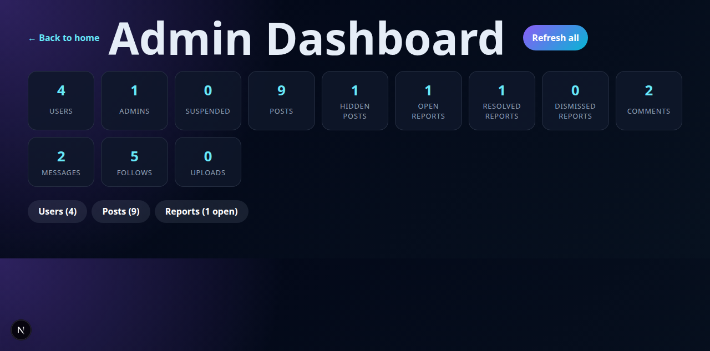

# MySazz Community

[](https://github.com/Jdrexx/SocialMediaMVP/actions/workflows/ci.yml)

A private, safety-first community MVP for adults moving forward with lived experience. MySazz combines member stories, mutual connections, encrypted messaging, WebRTC video, privacy-controlled profiles, and resource-navigation foundations.

> **Security status:** See [`docs/SECURITY.md`](docs/SECURITY.md) for implemented controls, sensitive-data boundaries, known limitations, and launch requirements.



## Features

- Express API with modular feature folders
- React/Next.js frontend in the App Router
- Mobile-friendly responsive UI
- Email/password auth with HTTP-only JWT cookie sessions
- Versioned 18+, recovery, confidentiality, terms, privacy, and care-scope attestations
- Authenticator-app two-factor authentication
- Production auth hardening: required strong `JWT_SECRET`, secure cookies, `trust proxy`, hidden Express signature, tight rate limits
- Real SMTP email for password reset and email verification
- Local dev-token fallback for reset/verification during development
- Privacy-controlled profiles with connection intentions, optional experience tags, approximate location, and presence
- Image/video media uploads for posts
- Likes, comments, follow/unfollow
- Notifications (likes, comments, follows, messages)
- User/post search
- Post, user, and message reporting with an admin moderation dashboard
- Mutual connection requests required before chat or video
- AES-256-GCM encrypted chat storage with privacy-safe notifications
- WebRTC video chat with Socket.IO signaling
- Typing indicators over WebSockets
- SSE compatibility for older clients
- Authenticated member stories and personal feed; no anonymous story or profile access
- Global block enforcement across discovery, feeds, follows, connections, messages, and calls
- Member data export and permanent account deletion
- SQLite for local/dev, persistent volume required for production
- API tests and feature scaffolding helper

## Quick Start

Single-server mode, matching Railway production:

```bash
npm install
npm run build
npm start
```

Open: http://localhost:3000

Development mode with hot reload:

```bash
# Terminal 1
npm start
# Terminal 2
npm run frontend:dev
```

Open: http://localhost:3001 (proxies `/api/*` and protected `/uploads/*` to port 3000)

Windows: double-click `run-social-mvp.bat`

## Tests

```bash
npm test
npm run frontend:build
```

All API tests pass and the Next.js production build succeeds.

## Admin Access

Production administrators are explicitly bootstrapped through `ADMIN_EMAILS`. The first-user shortcut remains available only in development/test and can be disabled with `BOOTSTRAP_FIRST_USER_ADMIN=false`.

Example accounts for local testing (register them fresh; the first local account becomes admin unless that shortcut is disabled):

| Username | Email | Password | Role |
|---|---|---|---|
| admin | admin@mysazz.local | Password123! | First local/admin |
| jane | jane@mysazz.local | Password123! | Member |

## Railway Deployment

Config in `railway.json`. Full instructions in `docs/RAILWAY_DEPLOYMENT.md`.

Minimum env vars:

```env
NODE_ENV=production
JWT_SECRET=<64+ char random secret>
DATA_ENCRYPTION_KEY=<64 hex characters>
PUBLIC_URL=https://your-domain.com
DB_FILE=/data/social.sqlite
UPLOAD_DIR=/data/uploads
ADMIN_EMAILS=owner@your-domain.com
```

Attach a Railway volume at `/data` so SQLite persists across redeploys.

## Environment Variables

```env
NODE_ENV=production
PUBLIC_URL=https://your-domain.com
JWT_SECRET=generate-a-64-character-random-secret
DATA_ENCRYPTION_KEY=generate-an-independent-64-character-hex-key
DB_FILE=/data/social.sqlite
UPLOAD_DIR=/data/uploads
ADMIN_EMAILS=owner@your-domain.com

SMTP_HOST=smtp.resend.com
SMTP_PORT=587
SMTP_SECURE=false
SMTP_USER=resend
SMTP_PASS=your-smtp-password
SMTP_FROM="MySazz <noreply@your-domain.com>"

NEXT_PUBLIC_API_URL=https://your-api-domain.com
```

Generate a strong secret:

```bash
node -e "console.log(require('crypto').randomBytes(32).toString('hex'))"
```

Production fails fast if `JWT_SECRET`, `DATA_ENCRYPTION_KEY`, or persistent database configuration is missing. Production requires verified email before member interactions. Use independent secrets and back them up securely; losing `DATA_ENCRYPTION_KEY` makes encrypted messages unreadable.

## Project Structure

```
app/                          # Next.js frontend
├── layout.tsx
├── page.tsx
├── about-us/page.tsx
├── privacy/page.tsx
├── resources/page.tsx
├── terms/page.tsx
├── rules-of-conduct/page.tsx
└── globals.css
legacy-frontend/              # Original HTML/JS/CSS frontend (pre-Next.js)
├── index.html
├── app.js
└── style.css
components/                   # Shared React components
├── api.ts                    # API client utility
├── AuthForm.tsx              # Login / registration / consent
├── MemberOnboarding.tsx      # Existing-member onboarding
├── ChatPanel.tsx             # Connection-gated messages + video
├── Feed.tsx                  # Post feed
├── ProfileCard.tsx           # Profile and privacy controls
└── SearchPanel.tsx           # Member discovery/connections
src/
├── app.ts                    # Express setup and feature registration
├── db.ts                     # SQLite/PostgreSQL schema initialization
├── server.ts                 # HTTP + Socket.IO entrypoint
├── features/
│   ├── index.ts              # Feature registry
│   ├── auth/routes.ts        # Auth, verification, MFA
│   ├── connections/routes.ts # Mutual connection lifecycle
│   ├── uploads/routes.ts     # Private media uploads
│   ├── users/routes.ts       # Profiles, privacy, export/delete
│   ├── posts/routes.ts       # Feed, post, like, comment
│   ├── moderation/routes.ts  # Reports and admin dashboard
│   └── messages/routes.ts    # Encrypted chat, SSE stream
└── lib/
    ├── auth.ts               # Shared auth/session helpers
    ├── crypto.ts             # Application-layer encryption
    ├── env.ts                # Runtime config and guards
    ├── membership.ts         # Consent/profile/connection helpers
    ├── realtime.ts           # Socket.IO setup
    └── schemas.ts            # Request validation
```

Detailed docs: [Architecture](docs/ARCHITECTURE.md) · [AI Resource Navigator](docs/AI_RESOURCE_NAVIGATOR.md) · [Adding Features](docs/ADDING_FEATURES.md) · [Deployment Readiness](docs/DEPLOYMENT_READY.md)

## Adding a Feature

```bash
npm run scaffold:feature bookmarks
```

Then register in `src/features/index.ts`, add tests, implement routes, and verify with `npm test && npm run build`.

## API Overview

### Auth
- `POST /api/auth/register`
- `POST /api/auth/login`
- `POST /api/auth/logout`
- `GET /api/auth/session`
- `POST /api/auth/password-reset/request`
- `POST /api/auth/password-reset/confirm`
- `POST /api/auth/email-verification/request`
- `POST /api/auth/email-verification/confirm`

### Users / Posts / Feed
- `GET /api/me` · `PATCH /api/me`
- `POST /api/me/onboarding` · `GET /api/me/export` · `DELETE /api/me`
- `POST /api/me/avatar` · `POST /api/me/cover`
- `GET /api/users/:username` · `POST /api/users/:username/follow`
- `GET /api/posts` · `GET /api/feed` (authenticated members only)
- `POST /api/posts` · `DELETE /api/posts/:id`
- `POST /api/posts/:id/like` · `POST /api/posts/:id/comments`

### Feature APIs
- `POST /api/uploads`
- `GET /api/notifications` · `POST /api/notifications/:id/read` · `POST /api/notifications/read-all`
- `GET /api/search?q=term`
- `GET /api/connections` · `POST /api/connections/:username/request`
- `POST /api/connections/:id/respond` · `DELETE /api/connections/:username`
- `POST /api/auth/2fa/setup` · `POST /api/auth/2fa/confirm` · `POST /api/auth/2fa/disable`
- `POST /api/reports/posts/:id`
- `GET /api/admin/reports` · `GET /api/admin/users`
- `DELETE /api/admin/posts/:id` · `POST /api/admin/users/:id/suspend`
- `GET /api/messages/threads` · `GET /api/messages/stream`
- `GET /api/messages/:username` · `POST /api/messages/:username`

## MVP Notes

- Configured SMTP sends real password reset and verification emails. Without SMTP, the API returns `dev_token` for local dev.
- Production admins come from `ADMIN_EMAILS`; no public first-user admin bootstrap.
- Socket.IO powers real-time messages, typing events, and WebRTC video-call signaling.
- Local uploads and SQLite are fine for demos. Production should use persistent storage, backups, and a managed database.
